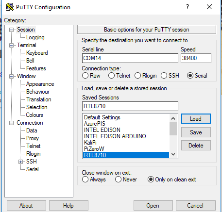
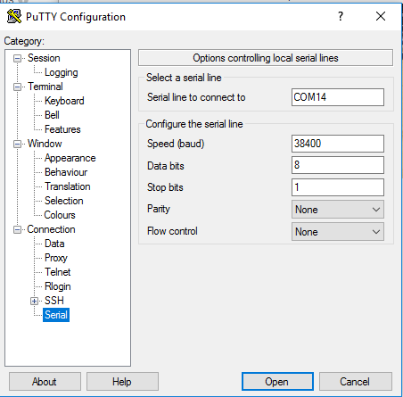
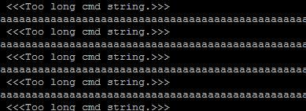

# RTL-00, RTL8710 AF  
## Description:  
Trying out the rtl8710 chip.  
Describing the attepmts to communicate with the chip using the AT commands.  
I was fallowing the guide provided by cnxsoft you can find at:  
[RTL8710_Getting_Started_Guide](http://www.cnx-software.com/2016/08/18/getting-started-with-bt-rtl-00-rtl8710-module-serial-console-at-commands-and-esp8266-pin-to-pin-compatibility/)
## Documents:  
Found datasheets and commands for the chip on the github:  
<a name="eggman">https://github.com/eggman/RTL8710_DOC</a>  
<a name="RTL00_datasheet_V1.0" target="_blank">https://github.com/vsobolyev/RTL8710/blob/master/RTL8710_DOC/RTL00_datasheet_V1.1.pdf</a>  
<a name="RTL01_datasheet_V1.1" target="_blank">https://github.com/vsobolyev/RTL8710/blob/master/RTL8710_DOC/RTL00_datasheet_V1.1.pdf</a>  
<a name="RTL8710_DEBUG_operation_manual_V1.0" target="_blank">https://github.com/vsobolyev/RTL8710/blob/master/RTL8710_DOC/RTL8710_DEBUG_operation_manual_V1.0.pdf</a>  

## Material  
### USB to TTL Adapter : FTDI232  
  
### RTL8710 chip  
  
### PuTTY

  

## RESULTS  
At first the chip would enter into loop with the following message:  
**[B&T_IOT_RTL8710] ######### NOT B&T FIREWARM CHECK FAILED!!! ##############**  
"Firewarm" is no mistake, it does say "FIREWARM" instead of Firmware.  
If I type a lot it would say:  
  
  
 After a while trying to make the chip work I've accidentally shortened the CHIP_EN pin.  
 The chip rebooted and I got a different result:  
   
 No commands are accepted, neither the wifi is initialized.

