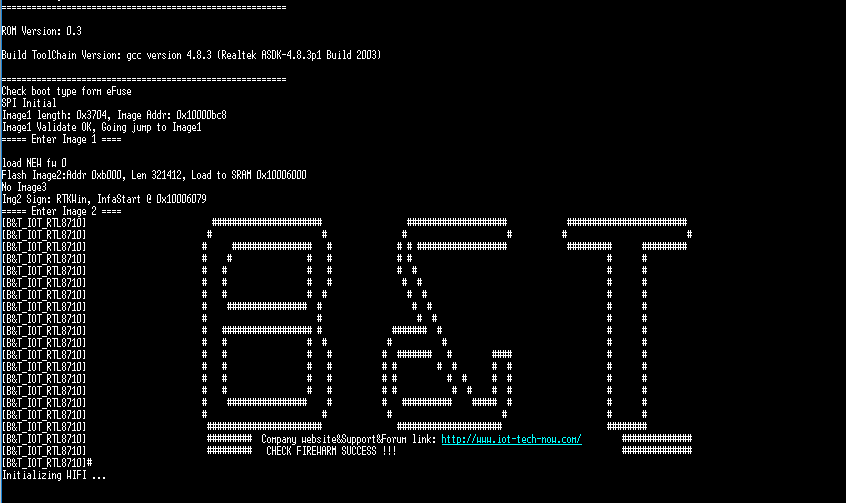
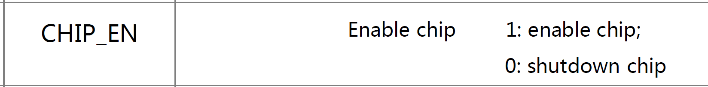

# RTL-00, RTL8710 AF  
## Description:  
Trying out the rtl8710 chip.  
Describing the attepmts to communicate with the chip using the AT commands.  
I was fallowing the guide provided by cnxsoft you can find at:  
[RTL8710_Getting_Started_Guide](http://www.cnx-software.com/2016/08/18/getting-started-with-bt-rtl-00-rtl8710-module-serial-console-at-commands-and-esp8266-pin-to-pin-compatibility/)
## Documents:  
Found datasheets and commands for the chip on the github:  
<a href="https://github.com/eggman/RTL8710_DOC" target="_blank">eggman docs</a>  
<a href="https://github.com/vsobolyev/RTL8710/blob/master/RTL8710_DOC/RTL00_datasheet_V1.1.pdf" target="_blank">RTL00_datasheet_V1.0</a>  
<a href="https://github.com/vsobolyev/RTL8710/blob/master/RTL8710_DOC/RTL00_datasheet_V1.1.pdf" target="_blank">RTL01_datasheet_V1.1</a>  
<a href="https://github.com/vsobolyev/RTL8710/blob/master/RTL8710_DOC/RTL8710_DEBUG_operation_manual_V1.0.pdf" target="_blank">RTL8710_DEBUG_operation_manual</a>  

## Material  
### USB to TTL Adapter : FTDI232  
  
### RTL8710 chip  
  
### PuTTY

  

## RESULTS  
At first the chip would enter into loop with the following message:  
**[B&T_IOT_RTL8710] ######### NOT B&T FIREWARM CHECK FAILED!!! ##############**  
"Firewarm" is no mistake, it does say "FIREWARM" instead of Firmware.  
If I type a lot it would say:  
  
  
 After a while trying to make the chip work I've accidentally shortened the CHIP_EN pin.  
 The chip rebooted and I got a different result:  
   
 No commands are accepted, neither the wifi is initialized.
 
 ## Measuring current  
 I was suggested to do the next:
### 	1/ Make sure that you supply enough power. Add a capacitor.  
First thing I did was to measure the amount of current that ftdi232 is able to deliver.  
The result was about 0.38 Amps.  
  
 Then I've added a capacitor  
   


###	2/ pull up CH_EN  

Also pulled up the chip_en pin.  
  
### Results  
Also I've connected an ammeter to the vcc pin to see what is the current consuption.  
Results are the following:  
#### PullUp Resistor -> Ground connected:  
Module won't boot, it's in the "shutdown chip" mode.  
  
Current withdrawal:  
  
#### PullUp Ground Open  
Chips starts to boot, but stops with the same message as before : "Starting wifi ..."  
Message:  

```
=========================================================

ROM Version: 0.3

Build ToolChain Version: gcc version 4.8.3 (Realtek ASDK-4.8.3p1 Build 2003)

=========================================================
Check boot type form eFuse
SPI Initial
Image1 length: 0x3704, Image Addr: 0x10000bc8
Image1 Validate OK, Going jump to Image1
===== Enter Image 1 ====

load NEW fw 0
Flash Image2:Addr 0xb000, Len 321412, Load to SRAM 0x10006000
No Image3
Img2 Sign: RTKWin, InfaStart @ 0x10006079
===== Enter Image 2 ====
[B&T_IOT_RTL8710]                         ######################                 ####################            ########################
[B&T_IOT_RTL8710]                        #                      #               #                    #          #                        #
[B&T_IOT_RTL8710]                       #     ################   #             # # ##################            #########      #########
[B&T_IOT_RTL8710]                       #    #               #   #             # #                                       #      #
[B&T_IOT_RTL8710]                       #   #                #   #             #  #                                      #      #
[B&T_IOT_RTL8710]                       #   #                #   #              #  #                                     #      #
[B&T_IOT_RTL8710]                       #   #                #  #                #  #                                    #      #
[B&T_IOT_RTL8710]                       #    ################  #                  #  #                                   #      #
[B&T_IOT_RTL8710]                       #                      #                   #  #                                  #      #
[B&T_IOT_RTL8710]                       #   ################## #              #######  #                                 #      #
[B&T_IOT_RTL8710]                       #   #                #  #            #          #                                #      #
[B&T_IOT_RTL8710]                       #   #                #   #          #  #######   #        ####                   #      #
[B&T_IOT_RTL8710]                       #   #                #   #          # #        #  #       #  #                   #      #
[B&T_IOT_RTL8710]                       #   #                #   #          # #          #  #     #  #                   #      #
[B&T_IOT_RTL8710]                       #   #                #   #          # #           #  #    #  #                   #      #
[B&T_IOT_RTL8710]                       #    ################    #          #   ##########    #####  #                   #      #
[B&T_IOT_RTL8710]                       #                       #            #                      #                    #      #
[B&T_IOT_RTL8710]                        #######################               #####################                     ########
[B&T_IOT_RTL8710]                        #########  Company website&Support&Forum link: http://www.iot-tech-now.com/        ##############
[B&T_IOT_RTL8710]                        #########   CHECK FIREWARM SUCCESS !!!                                             ##############
[B&T_IOT_RTL8710]#
Initializing WIFI ...
```

A strange thing happens with the current. The chip consumes 15 or 25 mAmps:  
    
  

